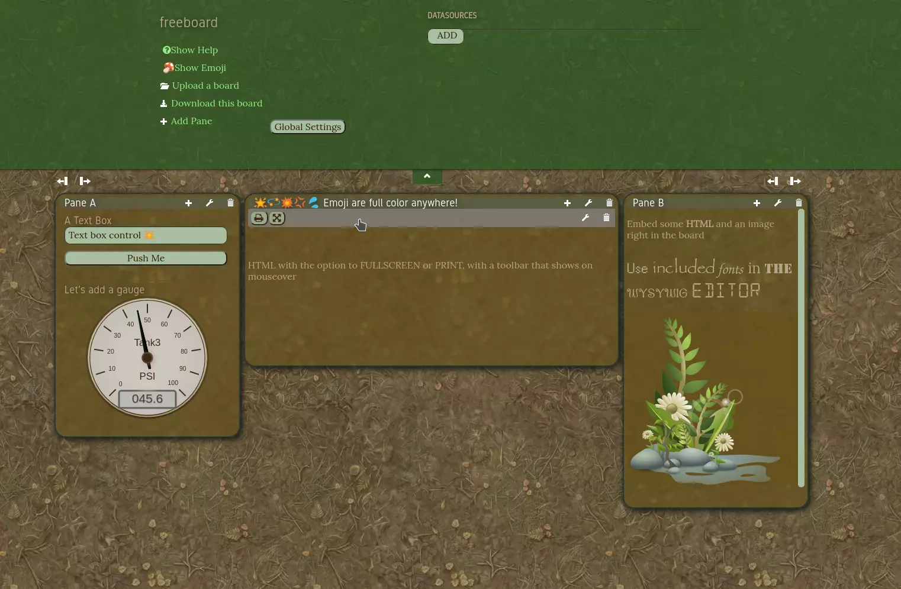

freeboard(fork!)
==========


### What this fork changes

* Widgets are no longer just inputs. We standardize data targets. Which are really just data soures that we assign to.
* Calculated expressions use Spreadsheet syntax. Anything that doesn't start with = is considered a literal value.
* Data targets can just be a writable data source that uses proxies to detect when you set it's keys
* But if they include an assignment or a function call, they are interpreted as literal javascript, so alert(value) works.
* Your widget instance can just call datatargets['settingName'](theValue) to set whatever target the user gave

* Input widgets just get or set exactly the raw data you enter(Previous versions of my fork used val, timestamp pairs, this caused trouple for future DB addons)

* There's a basic "scratchpad" data source for storing your variables.  It even has a persistane option, that makes it's data exportable as part of the board.
* Button, textbox, slider widgets

* WidgetInstance.processCalculatedSetting(settingName) is a public API function that widgets can use to force a refresh of a Calculated value.  But it is async!!
* #freeboard-extra-tools is now a div running across the whole bottom of the screen, set up as a flex container expecting children to be unstyled divs, for plugins to add stuff into.
* We use ES6 now, install this to be able to build: npm install gruntjs/grunt-contrib-uglify#harmony --save
* Async compatibility: your newInstance data source function can be async, widgets will still load after sources
* Async compatibility: if a calculated value expression returns a promise, we resolve it and use the result.

* We use FontAwesome.  Everything just works if you run directly, but if you embed, you may have to override the path to  @font-face FontAwesome with the right file.
* Datasources have a new setting type: button.  It takes an 'html' content param and an 'onclick' function that gets passed the (settungs,instanceobj)

* New widget setting type: trumbowyg-html, which works like the text widget, except you get a WYSYWIG editor wiht drag and drop image support(cpnverts to data URI)
* The "Rich text content" widget allows mustache templating withing WYSYWIG edited HTML

* Clock widget has custom strftime string capability

* Always-available libraries are now part of the core: Luxon, Math, Keyboard, Strftime
* The UI tries to render emoji with the Noto Color font(included) and supports FontAwesome glyphs wherever you want to paste them.

* freeboard.playSound function plays sounds either from a URL, or defined in the soundData global settings namespace.   There's a UI in settings to upload files.

**free·board** (noun) *\ˈfrē-ˌbȯrd\*

1. the distance between the waterline and the main deck or weather deck of a ship or between the level of the water and the upper edge of the side of a small boat.
2. the act of freeing data from below the "waterline" and exposing it to the world.
3. a damn-sexy, open source real-time dashboard builder/viewer for IOT and other web mashups.

### Demo
http://freeboard.github.io/freeboard

https://freeboard.io

### Screenshots(Forest.json theme)


### What is It?

Freeboard is a turn-key HTML-based "engine" for dashboards. Besides a nice looking layout engine, it provides a plugin architecture for creating datasources (which fetch data) and widgets (which display data)— freeboard then does all the work to connect the two together. Another feature of freeboard is its ability to run entirely in the browser as a single-page static web app without the need for a server. The feature makes it extremely attractive as a front-end for embedded devices which may have limited ability to serve complex and dynamic web pages.

The code here is the client-side portion of what you see when you visit a freeboard at http://freeboard.io. It does not include any of the server-side code for user management, saving to a database or public/private functionality— this is left up to you to implement should you want to use freeboard as an online service.

### How to Use

Freeboard can be run entirely from a local hard drive. Simply download/clone the repository and open index.html. When using Chrome, you may run into issues with CORS when accessing JSON based APIs if you load from your local hard-drive— in this case you can switch to using JSONP or load index.html and run from a local or remote web server.

1. git clone https://github.com/Freeboard/freeboard.git
2. cd freeboard
3. npm install
4. grunt

Then run a index.html or index-dev.html through a webserver.

### API

While freeboard runs as a stand-alone app out of the box, you can augment and control it from javascript with a simple API. All API calls are made on the `freeboard` singleton object.

-------

**freeboard.initialize(allowEdit, [callback])**

Must be called first to initialize freeboard.

> **allowEdit** (boolean) - Sets the initial state of freeboard to allow or disallow editing.

> **callback** (function) - Function that will be called back when freeboard has finished initializing.

-------

**freeboard.newDashboard()**

Clear the contents of the freeboard and initialize a new dashboard.

-------

**freeboard.serialize()**

Serializes the current dashboard and returns a javascript object.

-------

**freeboard.loadDashboard(configuration, [callback])**

Load the dashboard from a serialized dashboard object.

> **configuration** (object) - A javascript object containing the configuration of a dashboard. Normally this will be an object that has been created and saved via the `freeboard.serialize()` function.

> **callback** (function) - Function that will be called back when the dashboard has finished loading.

-------

**freeboard.setEditing(editing, animate)**

Programatically control the editing state of the of dashboard.

> **editing** (bool) - Set to true or false to modify the view-only or editing state of the board.

> **animate** (function) - Set to true or false to animate the modification of the editing state. This animates the top-tab dropdown (the part where you can edit datasources and such).

-------

**freeboard.isEditing()**

Returns boolean depending on whether the dashboard is in in the view-only or edit state.

-------

**freeboard.loadDatasourcePlugin(plugin)**

Register a datasource plugin. See http://freeboard.github.io/freeboard/docs/plugin_example.html for information on creating plugins.

> **plugin** (object) - A plugin definition object as defined at http://freeboard.github.io/freeboard/docs/plugin_example.html

-------

**freeboard.loadWidgetPlugin(plugin)**

Register a widget plugin. See http://freeboard.github.io/freeboard/docs/plugin_example.html for information on creating plugins.

> **plugin** (object) - A plugin definition object as defined at http://freeboard.github.io/freeboard/docs/plugin_example.html

-------

**freeboard.showLoadingIndicator(show)**

Show/hide the loading indicator. The loading indicator will display an indicator over the entire board that can be useful when you have some code that takes a while and you want to give a visual indication and to prevent the user from modifying the board.

> **show** (boolean) - Set to true or false to show or hide the loading indicator.

-------

**freeboard.showDialog(contentElement, title, okButtonTitle, cancelButtonTitle, okCallback, cancelCallback)**

Show a styled dialog box with custom content.

> **contentElement** (DOM or jquery element) - The DOM or jquery element to display within the content of the dialog box.

> **title** (string) - The title of the dialog box displayed on the top left.

> **okButtonTitle** (string) - The string to display in the button that will be used as the OK button. A null or undefined value will result in no button being displayed.

> **cancelButtonTitle** (string) - The string to display in the button that will be used as the Cancel button. A null or undefined value will result in no button being displayed.

> **okCallback** (function) - A function that will be called if the user presses the OK button.

-------

**freeboard.getDatasourceSettings(datasourceName)**

Returns an object with the current settings for a datasource or null if no datasource with the given name is found.

> **datasourceName** (string) - The name of a datasource in the dashboard.

-------

**freeboard.setDatasourceSettings(datasourceName, settings)**

Updates settings on a datasource.

> **datasourceName** (string) - The name of a datasource in the dashboard.

> **settings** (object) - An object of key-value pairs for the settings of the datasource. The values specified here will be combined with the current settings, so you do not need specify every setting if you only want to update one. To get a list of possible settings for a datasource, consult the datasource documentation or code, or call the freeboard.getDatasourceSettings function.

-------

**freeboard.on(eventName, callback)**

Attach to a global freeboard event.

> **eventName** (string) - The name of a global event. The following events are supported:

> **"dashboard_loaded"** - Occurs after a dashboard has been loaded.

> **"initialized"** - Occurs after freeboard has first been initialized.

> **callback** (function) - The callback function to be called when the event occurs.

-------

### Building Plugins

See http://freeboard.github.io/freeboard/docs/plugin_example.html for info on how to build plugins for freeboard.

### Testing Plugins

Just edit index.html and add a link to your javascript file near the end of the head.js script loader, like:

```javascript
...
"path/to/my/plugin/file.js",
$(function()
{ //DOM Ready
    freeboard.initialize(true);
});
```

### Copyright 

Copyright © 2013 Jim Heising (https://github.com/jheising)<br/>Copyright © 2013 Bug Labs, Inc. (http://buglabs.net)<br/>Licensed under the **MIT** license.

---
